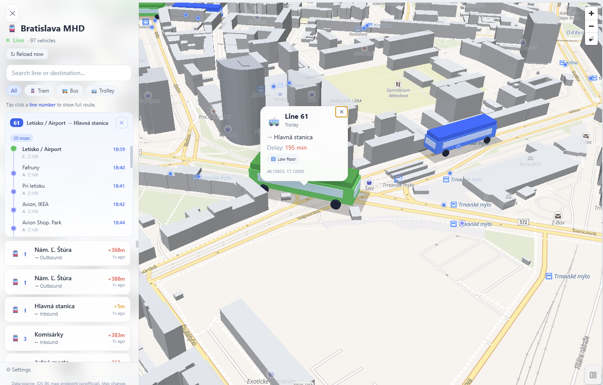
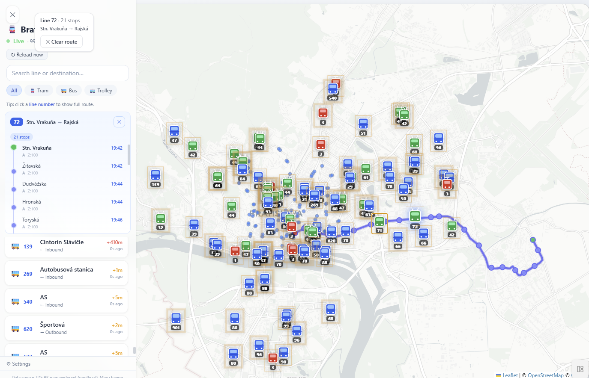

# 🚊 Bratislava MHD — Cozy Real-Time Tracker

A warm, cozy web app showing Bratislava public transport vehicles in real time on an interactive map.


## Setup & Run

```bash
# Install dependencies
npm install

# Start development server
npm run dev
```

Open [http://localhost:5173](http://localhost:5173) in your browser.

### Production build

```bash
npm run build
npm run preview
```

## Features

- **Real-time vehicle tracking** — buses, trams, and trolleybuses around Bratislava
- **Interactive map** — OpenStreetMap tiles via Leaflet, vehicle markers with pulse glow animation
- **Side panel** — search by line/destination, filter by vehicle type, click to focus on map
- **Cozy mode** — softer colours and reduced motion for a calmer experience
- **Status indicator** — Live / Drifting / Offline based on data freshness
- **Configurable** — radius, polling interval, center point, all persisted in localStorage
- **Graceful error handling** — exponential backoff on fetch errors

## Screenshots

Add app screenshots to `docs/screenshots/` with these names to have them rendered here:




## CORS & Proxy

The app fetches directly from `https://mapa.idsbk.sk/navigation/vehicles/nearby`.

If your browser blocks the request due to CORS:

1. Toggle **"Use proxy"** in the sidebar settings
2. Uncomment the proxy block in `vite.config.ts`
3. Restart the dev server

The proxy rewrites `/api/*` requests to the IDS BK endpoint, bypassing browser CORS restrictions.

## Architecture

```
src/
├── types.ts              # TypeScript types & defaults
├── main.tsx              # Entry point
├── App.tsx               # Root component
├── index.css             # Tailwind + custom styles
├── hooks/
│   ├── useVehicles.ts    # Fetch + poll with exponential backoff
│   └── useSettings.ts    # localStorage-persisted settings
├── components/
│   ├── MapView.tsx       # Leaflet map container
│   ├── VehicleMarker.tsx # Individual marker with DivIcon
│   ├── VehiclePopup.tsx  # Cozy popup card
│   ├── SidePanel.tsx     # Collapsible left panel
│   ├── VehicleListItem.tsx # Vehicle row in list
│   ├── StatusIndicator.tsx # Live/Drifting/Offline
│   └── SettingsPanel.tsx # Configuration controls
└── utils/
    ├── normalize.ts      # API → internal type normalisation
    └── time.ts           # Relative time & status helpers
```

## Key Design Decisions

### Polling with Exponential Backoff
The app polls the endpoint at the configured interval (default 5s). On errors, the interval doubles each time (capped at ~60s) to avoid hammering a broken endpoint. Success resets the backoff to 1×.

### Data Normalisation
The raw API response is normalised into an internal `Vehicle` type. Previous positions are preserved so markers can animate smoothly to new locations. A compound key (`vehicleID-lastStopOrder`) handles the API returning the same vehicle at multiple positions.

### Marker Animation
CSS transitions on the marker DOM nodes (`transition: left 0.6s, top 0.6s`) create smooth gliding motion when vehicle positions update. In Cozy mode, animations are slower (4s pulse vs 2.5s).

## Data Source

> **Data source: IDS BK map endpoint (unofficial). May change without notice.**

This app uses an unofficial/internal API from [mapa.idsbk.sk](https://mapa.idsbk.sk). The endpoint structure and availability are not guaranteed.

## License

MIT
